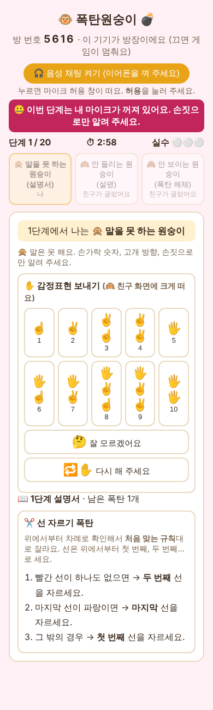
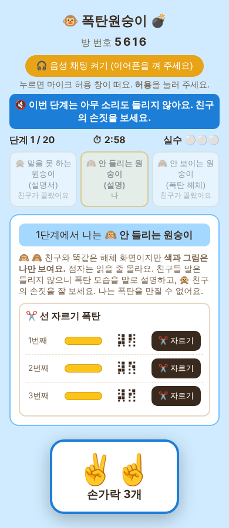
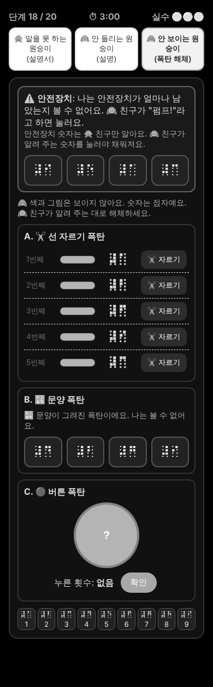

# 🐵 폭탄원숭이 💣

**세 원숭이가 힘을 합쳐 폭탄을 해체하는 협동 게임**
장애이해교육을 위해 만든 초등학생용 웹 게임이에요.

 

## 👉 [🎮 게임 하러 가기](https://strawberry0401.github.io/bombanana/) 👈

https://strawberry0401.github.io/bombanana/

 

---

## 🙊 🙉 🙈 세 원숭이

| 🙊 말을 못 하는 원숭이 | 🙉 안 들리는 원숭이 | 🙈 안 보이는 원숭이 |
|:---:|:---:|:---:|
| 설명서를 가지고 있어요. 마이크가 꺼져서 손짓과 감정표현으로만 알려 줘요. | 폭탄을 색까지 볼 수 있어요. 하지만 아무 소리도 들리지 않고 점자는 못 읽어요. | 폭탄을 만질 수 있는 유일한 원숭이예요. 세상이 까맣고, 숫자는 점자로만 보여요. |
|  |  |  |

세 명이 모두 도와야만 폭탄을 해체할 수 있어요.

## 🕹️ 하는 방법

1. **3명**이 각자 기기(태블릿, 노트북, 휴대폰)로 [게임 링크](https://strawberry0401.github.io/bombanana/)에 들어가요.
2. 한 명이 **방 만들기**를 누르고, 나온 **방 번호 4자리**를 친구들에게 알려 줘요.
3. 친구들은 방 번호를 넣고 **들어가기**를 눌러요.
4. 모두 **이어폰**을 끼고 **음성 채팅 켜기**를 눌러요. (마이크 허용 창이 뜨면 **허용**)
5. **게임 시작**! 역할은 단계마다 랜덤으로 바뀌어요.

혼자 미리 살펴보고 싶으면 **한 기기로 연습하기**를 눌러 세 역할을 모두 볼 수 있어요.

## 💣 게임 규칙

- 모두 **20단계**, 단계마다 **3분** 안에 해체해야 해요.
- 실수를 **3번** 하면 폭탄이 터져요. 같은 단계를 다시 할 수 있어요.
- 폭탄 종류: ✂️ 선 자르기 · 🔴 버튼 · 🔊 소리 · 💡 모스부호 · 🔣 문양
- 높은 단계에서는 폭탄이 **최대 3종류**까지 한꺼번에 나와요.
- **5단계부터** 🙈 원숭이는 안전장치가 줄어들지 않게 계속 펌프를 눌러야 해요.

---

소담초등학교 장애이해교육 · 아이디어는 협동 폭탄 해체 게임에서 얻었어요.

